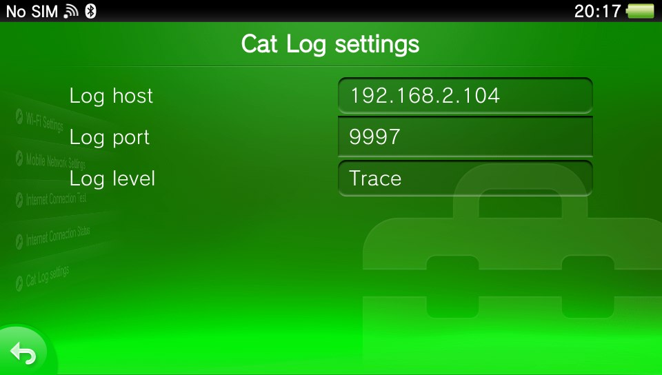

Cat-A-Log
---

PlayStation® Vita™ network logging plugin

## Installation:

1. Copy both skprx/suprx into `ur0:tai`
2. Add `ur0:tai/catlog.skprx` under `*KERNEL` in `ur0:tai/config.txt`
3. Add `ur0:tai/catlog.suprx` under `*NPXS10015` in `ur0:tai/config.txt`
4. Reboot
5. On linux run `nc -kl <port>` (on windows you can use https://github.com/TeamFAPS/PSVita-RE-tools/blob/master/PrincessLog/build/NetDbgLogPc.exe <port>)
6. Open `Settings` app -> `Network` -> `Cat Log settings` and adjust settings for your target pc.

## Logging in homebrew
* Kernel: ksceKernelPrintf, etc.
* User: sceClibPrintf or printf

## Credits
* [Princess-of-Sleeping](https://github.com/Princess-of-Sleeping), [cuevavirus](https://git.shotatoshounenwachigau.moe/) - PrincessLog
* [SKGleba](https://github.com/SKGleba) - settings menu idea and injection code
* [Electry](https://github.com/Electry) - wifi patch
* CBPS